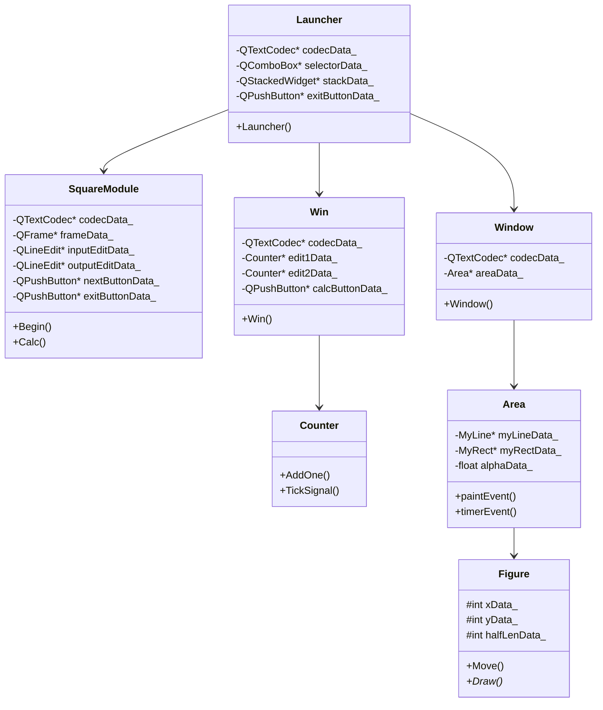

# programming_tech_lab_widgets

Учебный проект — набор Qt Widgets модулей, запускаемых из единого окна-лаунчера.

## Модули

| Модуль | Описание |
|---|---|
| `square_module` | Вычисление квадрата числа с валидацией ввода |
| `counter_module` | Счётчик с сигналом на каждом пятом значении |
| `figure_module` | Аниматор вращающихся фигур (линия и прямоугольник) |
| `launcher_module` | Лаунчер: выбор модуля через выпадающий список |

## Архитектура

```
launcher_module
├── square_module
├── counter_module
└── figure_module
```

`launcher_module` компонует все три модуля в `QStackedWidget`. Выбор через `QComboBox` переключает отображаемый виджет.

## Диаграмма классов



## Сборка

### Зависимости

- CMake ≥ 3.16
- Qt 5 (модуль Widgets)
- Компилятор с поддержкой C++17

### Команды

```bash
cmake -S . -B build
cmake --build build
./build/programming_tech_lab_widgets
```

## Использование

При запуске открывается окно лаунчера. В выпадающем списке выберите нужный модуль — он отобразится в нижней части окна